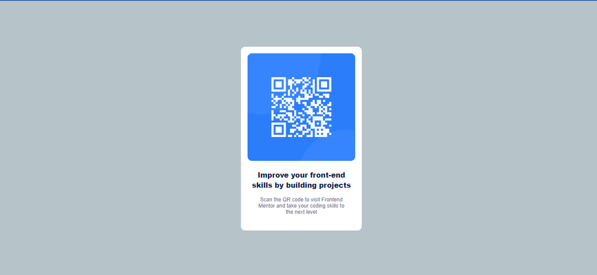

# Frontend Mentor - QR code component solution

This is a solution to the [QR code component challenge on Frontend Mentor](https://www.frontendmentor.io/challenges/qr-code-component-iux_sIO_H).

## Table of contents

- [Overview](#overview)
  - [Screenshot](#screenshot)
  - [Links](#links)
  - [Built with](#built-with)
  - [What I learned](#what-i-learned)
- [Author](#author)

**Note: Delete this note and update the table of contents based on what sections you keep.**

## Overview

### Screenshot

### Links

- Solution URL: [Add solution URL here](https://your-solution-url.com)
- Live Site URL: [Add live site URL here](https://your-live-site-url.com)

## My process

### Built with

- Semantic HTML5 markup
- CSS custom properties
- Flexbox
- Mobile-first workflows

### What I learned

I re-learned the concepts of front end development using HTML5 markup, inline CSS styling, media query and best practices.

To see how you can add code snippets, see below:

## Author

- Website - [codepipr](https://www.codepipr-portfolio.netlify.app)
- Frontend Mentor - [@yourusername](https://www.frontendmentor.io/profile/deddypiper)
- Twitter - [@yourusername](https://www.twitter.com/deddypiper)